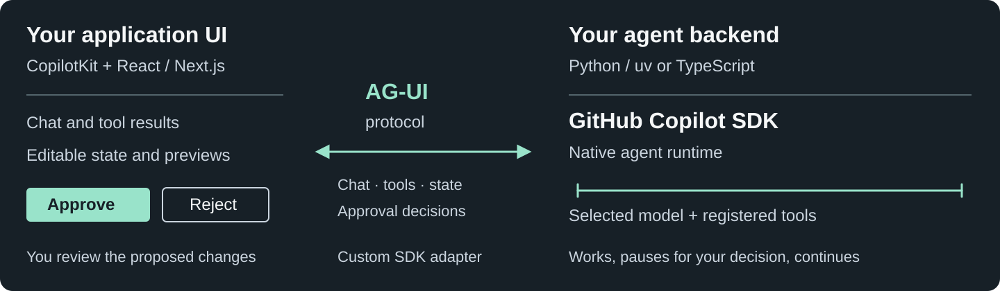

# GitHub Copilot SDK + AG-UI + CopilotKit

**Build your own Cowork-style agent experience: GitHub Copilot's agent runtime behind an interactive app, not just a chat box.**

▶ **See it in action:** [2:50 highlight video](https://github.com/ArlindNocaj/copilot-sdk-ag-ui-frontend-demo/releases/download/gallery-v10/highlights-v10.mp4) · [full gallery with all 12 clips](https://github.com/ArlindNocaj/copilot-sdk-ag-ui-frontend-demo/releases/tag/gallery-v10) (download the ZIP, open `index.html`; no setup needed)

## Why use it

- **The agent works inside your UI.** It can show results as cards, charts and editable proposals, read and update shared app state, and pause for your approval before acting.
- **You don't build the agent runtime.** GitHub Copilot SDK runs the agent loop, model and tools. You own the app code and choose its tools, integrations and hosting.

## How it works



1. **You ask, click or edit** in the React app built with CopilotKit.
2. **The backend runs the agent** with GitHub Copilot SDK: the model plus the tools you register.
3. **AG-UI streams everything back**: messages, tool calls, state updates and approval requests. Your decision resumes the paused tool call, so the agent continues where it stopped.

## Get started

You need Node 24.13+, pnpm 10.33.4, Python 3.11+, [uv](https://docs.astral.sh/uv/) and the [Copilot CLI](https://docs.github.com/en/copilot/how-tos/copilot-cli/install-copilot-cli), signed in (run `copilot`, then `/login`) with a Copilot plan that includes model access.

```sh
git clone https://github.com/ArlindNocaj/copilot-sdk-ag-ui-frontend-demo.git
cd copilot-sdk-ag-ui-frontend-demo
pnpm install --frozen-lockfile
uv sync --project backend/python --extra server --locked --default-index https://pypi.org/simple
pnpm dev:python
```

Open http://127.0.0.1:3310 and try [Document review](http://127.0.0.1:3310/features/predictive_state_updates), [Shared state](http://127.0.0.1:3310/features/shared_state) or [Release readiness](http://127.0.0.1:3310/showcases/release-readiness). **Ctrl+C** stops everything.

---

This is an unauthenticated local sample with fictional data; don't expose it publicly. A TypeScript backend, a no-login mock mode, all examples, configuration and security notes are in the [reference](docs/reference.md).
