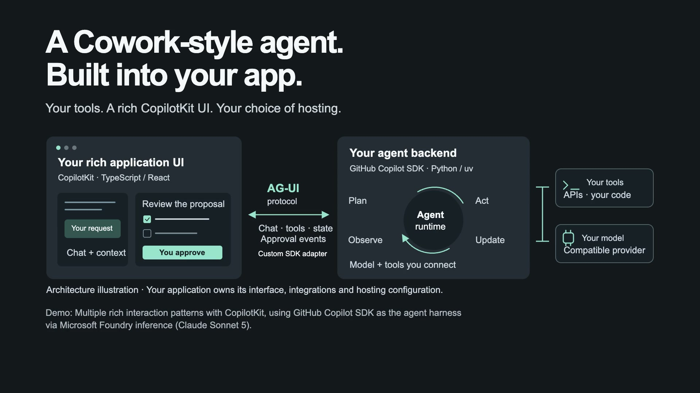
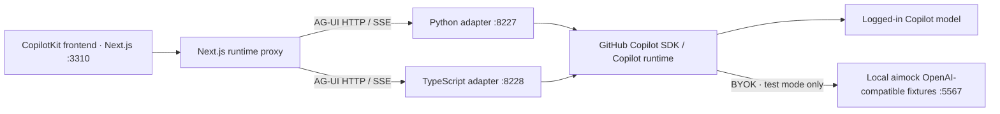

# GitHub Copilot SDK + AG-UI + CopilotKit

**Build your own Cowork-style agent experience: GitHub Copilot's agent runtime behind an interactive app, not just a chat box.**

## Why use it

- **A battle-tested, production-ready harness under your control.** GitHub Copilot SDK exposes the [Copilot runtime used by Copilot Cowork and Microsoft 365 apps](https://github.blog/ai-and-ml/generative-ai/migrating-the-github-copilot-runtime-to-rust-using-copilot/), so you can build your own Cowork-style experience.
- **Rich UI from CopilotKit, powered by that harness.** Build cards, charts, editable proposals, shared app state and approval controls. AG-UI connects these frontend interactions to the agent running in your backend.
- **You don't build the agent runtime.** GitHub Copilot SDK provides the agent loop and orchestrates model and tool calls. You own the app code and choose its tools, integrations and hosting.

▶ **[Watch the gallery in your browser](https://arlindnocaj.github.io/copilot-sdk-ag-ui-frontend-demo/)** — a 2:50 highlight and all 12 demos. No download, login or setup. [Offline downloads](https://github.com/ArlindNocaj/copilot-sdk-ag-ui-frontend-demo/releases/tag/gallery-v10) are optional.

[](https://arlindnocaj.github.io/copilot-sdk-ag-ui-frontend-demo/)

## How it works


The same UI works with either backend; the quickstart below uses Python.



1. **You ask, click or edit** in the React app built with CopilotKit.
2. **The backend runs the agent** with GitHub Copilot SDK: the model plus the tools you register.
3. **AG-UI streams everything back**: messages, tool calls, state updates and approval requests. Your decision resumes the paused tool call, so the agent continues where it stopped.

## Get started

You need Node 24.13+, pnpm 10.33.4, Python 3.11+ and [uv](https://docs.astral.sh/uv/). The commands below install the [GitHub Copilot SDK](https://github.com/github/copilot-sdk). Default live mode requires [Copilot authentication](docs/reference.md#troubleshooting) and a plan that includes model access.

```sh
git clone https://github.com/ArlindNocaj/copilot-sdk-ag-ui-frontend-demo.git
cd copilot-sdk-ag-ui-frontend-demo
pnpm install --frozen-lockfile
uv sync --project backend/python --extra server --locked --default-index https://pypi.org/simple
pnpm dev:python
```

Open http://127.0.0.1:3310 and try [Document review](http://127.0.0.1:3310/features/predictive_state_updates), [Shared state](http://127.0.0.1:3310/features/shared_state) or [Release readiness](http://127.0.0.1:3310/showcases/release-readiness). **Ctrl+C** stops everything.

---

This is an unauthenticated local sample with fictional data; don't expose it publicly. A TypeScript backend, a no-login mock mode, all examples, configuration and security notes are in the [reference](docs/reference.md).
