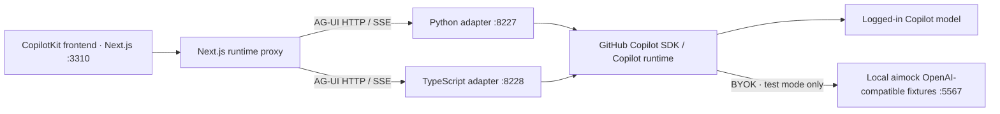

# Demo reference

[Back to the quick start](../README.md).

Configuration, example catalog, recorded checks, and operating limits for the standalone demo. All commands below run from the repository root.

## Contents

- [Run modes and environment](#run-modes-and-environment)
- [Simple examples](#simple-examples)
- [Rich showcases](#rich-showcases)
- [Checks and recorded results](#checks)
- [Source and dependency status](#source-and-dependency-status)
- [Security and production caveats](#security-and-production-caveats)
- [Troubleshooting](#troubleshooting)

## Run modes and environment

The root [quick start](../README.md#get-started) covers installation and Copilot login. `corepack enable` can enable pnpm if needed; uv **0.9.29** was used during development. The SDK starts its own native runtime; it does not shell out to a chat transcript or fake tool execution.

Choose one live backend:

```sh
pnpm dev:typescript
# or
pnpm dev:python
```

Each command starts the selected backend and the frontend at http://127.0.0.1:3310; Ctrl+C stops both. The same page routes work with either backend. The **Backend** selector reloads the page into a new conversation; the selected backend must be running. A one-backend start selects that backend by default.

For a repeatable demo without model charges or login:

```sh
uv sync --project backend/python --extra server --locked --default-index https://pypi.org/simple
pnpm dev:mock
```

This starts **both backends**, the frontend, and **`@copilotkit/aimock` 1.37.4**, a local OpenAI-compatible fixture server. Its scenarios adapt the verified Dojo aimock contracts without copying the old custom SDK fixture clients. The real SDK runtime calls this model endpoint via BYOK. It does **not** replace the adapter or fabricate AG-UI events. Mock prompts are deliberately fixture-specific; use the example/proposal/follow-up buttons for repeatable results. Arbitrary prompts need live mode.

No database, Docker, external weather service, booking service, or API key is needed for deterministic mode.

### Local topology

Both backend choices are shown; a live demo needs only one. Python-only server details are in the [backend guide](../backend/python/README.md).



### Environment

| Variable | Default | Purpose |
|---|---|---|
| `COPILOT_MODEL` | `gpt-5.4-mini` | Live Copilot model available to your account |
| `OPENAI_BASE_URL` | unset | Opt into an OpenAI-compatible BYOK endpoint |
| `OPENAI_API_KEY` | unset | BYOK credential; never commit one |
| `OPENAI_CHAT_MODEL_ID` | `gpt-4o` | BYOK model ID |
| `DEMO_BACKEND` | `typescript` | Frontend default; root runner sets it |
| `DEMO_MODE` | live | Root mock runner sets `mock` for honest UI labeling |
| `TYPESCRIPT_BACKEND_URL` | `http://127.0.0.1:8228` | Server-side proxy destination, loopback HTTP only |
| `PYTHON_BACKEND_URL` | `http://127.0.0.1:8227` | Server-side proxy destination, loopback HTTP only |
| `FRONTEND_ORIGIN` | `http://127.0.0.1:3310` | Accepted browser origin at backend |
| `PORT` | 8227 Python / 8228 TS | Backend port when started directly |
| `HOST` | `127.0.0.1` | Loopback only; external binding is refused |

The root runner reserves 3310, 8227, 8228, and (mock only) 5567. It refuses occupied ports rather than reusing another service. Stop an existing demo before starting another.

## Simple examples

Each route uses the original verified agent/tool/state names. The UI is deliberately smaller than Dojo: semantic cards, checkboxes, a plain Markdown preview, and a native-subagent lifecycle panel, without Dojo's integration shell, source viewer, analytics, rich-text editor, carousel, or theme system.

| Route under `/features/` | What it demonstrates | Screenshots |
|---|---|---|
| `agentic_chat` | Native text deltas become chat messages | [TS](../screenshots/simple/typescript/agentic_chat.png) / [Python](../screenshots/simple/python/agentic_chat.png) |
| `backend_tool_rendering` | `get_weather` executes on the backend; its real result renders a card | [TS](../screenshots/simple/typescript/backend_tool_rendering.png) / [Python](../screenshots/simple/python/backend_tool_rendering.png) |
| `human_in_the_loop` | `generate_task_steps` pauses; edited selections resolve the original pending call | [TS](../screenshots/simple/typescript/human_in_the_loop.png) / [Python](../screenshots/simple/python/human_in_the_loop.png) |
| `tool_based_generative_ui` | Frontend `generate_haiku` renders a card | [TS](../screenshots/simple/typescript/tool_based_generative_ui.png) / [Python](../screenshots/simple/python/tool_based_generative_ui.png) |
| `shared_state` | Backend `generate_recipe` snapshots state; UI ingredient edits reach the next prompt | [TS](../screenshots/simple/typescript/shared_state.png) / [Python](../screenshots/simple/python/shared_state.png) |
| `agentic_generative_ui` | Predicted `steps` become committed completion snapshots | [TS](../screenshots/simple/typescript/agentic_generative_ui.png) / [Python](../screenshots/simple/python/agentic_generative_ui.png) |
| `predictive_state_updates` | `write_document` arguments predict state; approval commits, rejection restores | [TS](../screenshots/simple/typescript/predictive_state_updates.png) / [Python](../screenshots/simple/python/predictive_state_updates.png) |
| `agentic_chat_reasoning` | Provider-supplied `REASONING_*` events, separate from assistant text | [TS](../screenshots/simple/typescript/agentic_chat_reasoning.png) / [Python](../screenshots/simple/python/agentic_chat_reasoning.png) |
| `agentic_chat_multimodal` | Inline uploaded image becomes a native SDK blob attachment | [TS](../screenshots/simple/typescript/agentic_chat_multimodal.png) / [Python](../screenshots/simple/python/agentic_chat_multimodal.png) |
| `interrupt` | `schedule_meeting` pauses for a time choice or cancellation | [TS](../screenshots/simple/typescript/interrupt.png) / [Python](../screenshots/simple/python/interrupt.png) |
| `subgraphs` | Native flight, hotel, and experience specialists; choices survive pause/resume | [TS](../screenshots/simple/typescript/subgraphs.png) / [Python](../screenshots/simple/python/subgraphs.png) |
| `deepagents_subagents` | Native research subagent attribution and approve/reject interrupt | [TS](../screenshots/simple/typescript/deepagents_subagents.png) / [Python](../screenshots/simple/python/deepagents_subagents.png) |

All **24 simple screenshots** are fresh captures from this standalone frontend's passing deterministic aimock browser run on **2026-09-18**, using the adapter pinned to **8665f1ee**. They replace the original seed captures from the verified Dojo run.

## Rich showcases

Both routes use the same frontend and Python/TypeScript selector as the simple examples. The agent calls `review_plan`: its validated proposal changes the chart and filter, stages three actions, and pauses the native tool call for review. Select actions individually, edit owners/titles, and commit only the approved subset. A backend-issued receipt resumes the original call; a subsequent question reads the new authoritative state rather than trusting chat history.

| Route | What changes the decision | Fresh browser captures |
|---|---|---|
| `/showcases/release-readiness` | Raw failures favor Checkout; failure rates favor Payments; the urgent slice instead ranks Catalog first. Inspect denominators before allocating investigation work. | [TS before](../screenshots/rich/typescript/release-readiness-before.png), [review](../screenshots/rich/typescript/release-readiness-review.png), [after](../screenshots/rich/typescript/release-readiness-after.png) / [Python before](../screenshots/rich/python/release-readiness-before.png), [review](../screenshots/rich/python/release-readiness-review.png), [after](../screenshots/rich/python/release-readiness-after.png) |
| `/showcases/support-triage` | Equal ticket counts conceal different ages; age distributions highlight Blair, while urgent SLA breaches shift attention to Dana. Review reassignment rather than treating every ticket as equal work. | [TS before](../screenshots/rich/typescript/support-triage-before.png), [review](../screenshots/rich/typescript/support-triage-review.png), [after](../screenshots/rich/typescript/support-triage-after.png) / [Python before](../screenshots/rich/python/support-triage-before.png), [review](../screenshots/rich/python/support-triage-review.png), [after](../screenshots/rich/python/support-triage-after.png) |

**Release readiness:** 40 fictional items contain 95 failures across 840 attempts. Checkout has 42/420 failures, Catalog 27/300, Identity 16/80, and Payments 10/40. The raw-count and rate rankings therefore disagree. Within urgent P1 work, Catalog is 18/60, Identity 5/20, Payments 3/12, and Checkout 9/90. The UI flags denominators below 25 as a caution, not a statistical confidence guarantee. Completing a work item does not erase historical attempts or failures.

**Support triage:** 36 records include 32 open tickets, 537 age-hours, and 10 fictional SLA breaches. Avery and Blair each have eight open tickets, but their mean ages are 8 and 34 hours, with zero and six breaches respectively. On the urgent P1 slice, Dana has four breaches and Blair two. Ages are fixed fixture measurements, not a clock that drifts between runs. Histogram bins are `[0,8)`, `[8,24)`, `[24,72)`, and `72+` hours; the strict fictional SLA is age greater than 4/24/72 hours for P1/P2/P3.

Reassignment conserves total open count, summed age, and breaches; resolution does not. Resolving `SUP-BLA-03` leaves 31 open, 501 age-hours, and nine breaches. Support drafts are **saved only**, never sent. Rejected actions never appear as committed work. The store checks revisions, validates proposals against observed tool arguments, and makes repeated submission IDs idempotent. Reloading creates a fresh fictional workspace.

All **12 rich screenshots** (before, review, after for both showcases and backends) come from the same passing standalone aimock run. Invalid proposals fail closed and provide a **Start new workspace** action. If a successful commit's response is lost, the UI reads back the exact stored receipt before continuing the native call; it never invents approval.

## Checks

Tests use Playwright's own Chromium, never an existing Edge/CDP profile. Install it before running browser tests:

```sh
pnpm exec playwright install chromium
```

```sh
pnpm test              # typechecks, adapter units, fixture units, Python checks/build, Next/TS builds
pnpm test:e2e          # deterministic browser scenarios against both backends
pnpm test:live         # one logged-in real model chat per backend; separate from mock tests
```

The browser command builds the frontend, then starts the production frontend and both backend choices itself. Tests cover approval/rejection and alternate selections and write fresh screenshots. Temporary traces/results stay ignored.

### Fork-main alignment check — 2026-10-07

The updated adapter passed **23 TypeScript adapter tests**, **15 TypeScript domain tests**, and **107 Python tests**. Frontend/backend typechecks, TypeScript backend compilation, and Ruff on the updated Python tests also passed. All **34 vendored adapter/example source files** match fork commit `7709498572efe34b9648ac78c94dab3427441bea`, accounting only for standalone TypeScript example imports. The updated adapter tests likewise match that commit, with standalone TypeScript imports.

These are no-model checks. No demo services or live/browser scenarios were started for this update; the browser/live evidence below remains historical.

### Verified results — 2026-09-18

| Check | TypeScript | Python |
|---|---|---|
| Type / unit checks | Frontend/backend typechecks; 16 adapter + 15 domain/store tests passed | 107 pytest tests; Ruff passed |
| Build | Backend and Next.js production build passed; compiled backend health/workbench smoke passed | Source distribution and wheel built from that distribution |
| Live `agentic_chat` | curl-level SDK flow passed: Paris + `RUN_FINISHED` | curl-level SDK flow passed: Paris + `RUN_FINISHED` |
| Simple browser journeys | 16/16 passed: 12 primary + 4 branches | 16/16 passed: 12 primary + 4 branches |
| Rich browser journeys | 5/5 passed: 2 primary + 3 recovery | 5/5 passed: 2 primary + 3 recovery |

`pnpm test` passed. The fixture/data suite passed **11 tests**; its optional native-runtime smoke is skipped by default and was **separately run and passed** with `RUN_MOCK_SDK_SMOKE=1 node --import tsx --test tests/mock-model-runtime.test.mjs` (all 12 simple entry paths; 18 real SDK streaming requests). `pnpm test:e2e` passed **42/42**, with zero failures/skips/retries, in 56.9 seconds. `pnpm test:live` passed both logged-in model flows. Live results do not claim all rich or approval scenarios are model-quality tested.

| Feature | TypeScript | Python |
|---|---|---|
| `agentic_chat` | playwright-pass | playwright-pass |
| `backend_tool_rendering` | playwright-pass | playwright-pass |
| `human_in_the_loop` | playwright-pass | playwright-pass |
| `tool_based_generative_ui` | playwright-pass | playwright-pass |
| `shared_state` | playwright-pass | playwright-pass |
| `agentic_generative_ui` | playwright-pass | playwright-pass |
| `predictive_state_updates` | playwright-pass | playwright-pass |
| `agentic_chat_reasoning` | playwright-pass | playwright-pass |
| `agentic_chat_multimodal` | playwright-pass | playwright-pass |
| `interrupt` | playwright-pass | playwright-pass |
| `subgraphs` | playwright-pass | playwright-pass |
| `deepagents_subagents` | playwright-pass | playwright-pass |
| Release readiness | playwright-pass | playwright-pass |
| Support triage | playwright-pass | playwright-pass |

Additional browser branches cover meeting cancellation, subagent rejection, document rejection preserving accepted state, alternate travel choices, invalid/wrong-workflow proposal recovery, and lost commit-response recovery.

**Install limitation:** direct public package downloads were blocked on this development network. Approved-mirror installation and portable-lock frozen/offline installs passed for pnpm and uv. Added Python dependency hashes were compared with public PyPI metadata before normalizing artifact URLs; both lockfiles contain zero private registry URLs. A clean, uncached public-registry install still needs external verification. No private registry configuration is required by this repository.

## Source and dependency status

The demo vendors the integration from **fork `main`**, not a published integration package. On **2026-10-07**, the verified tip was:

- [Current fork integration](https://github.com/ArlindNocaj/ag-ui/tree/main/integrations/copilot-sdk)
- [Pinned source commit 7709498572efe34b9648ac78c94dab3427441bea](https://github.com/ArlindNocaj/ag-ui/commit/7709498572efe34b9648ac78c94dab3427441bea)
- [Merged fork PR](https://github.com/ArlindNocaj/ag-ui/pull/1)
- [Open upstream integration issue: ag-ui-protocol/ag-ui#2887](https://github.com/ag-ui-protocol/ag-ui/issues/2887) (**issue**, not a pull request)

The small MIT-licensed adapters and twelve example definitions match that source in `backend/python/ag_ui_copilot_sdk`, `backend/python/agents`, `backend/typescript/src/ag_ui_copilot_sdk`, and `backend/typescript/src/agents`. TypeScript example imports are adjusted to the standalone folder; the hosts retain their request-boundary checks. The update brings in TypeScript clone-family session sharing and cancellation wake-up fixes, with corresponding regression tests. Python runtime sources and all example definitions are unchanged from the earlier pin. Copilot SDK remains **1.0.14** in both languages; no dependency version change is required by this fork-main alignment.

When hosting the TypeScript adapter directly in CopilotKit, reuse a long-lived `CopilotAgent`. Request clones share native sessions and pending calls; separately constructed agents remain independent. Call `close()` at host shutdown, not after each request: closing any clone closes its family's sessions.

Frontend contracts and mock fixtures retain their historical [8665f1ee source](https://github.com/ArlindNocaj/ag-ui/commit/8665f1ee1aeb5fe7f873a850b20df9af0c4fbba2). The screenshot dates and recorded 2026-09-18 results above describe that earlier version, not a new full browser/live run against the updated adapter. Existing demo videos likewise remain evidence of their recorded source fingerprints; source alignment does not revalidate or recapture footage. Original AG-UI MIT terms are preserved in [LICENSE](../LICENSE).

The rich domain logic, deterministic data, contracts, review UI, and focused tests are adapted from the supplied `ag-ui-rich-showcases` product sources. Historical evidence archives, old gateways/adapters, dual-app infrastructure, logs, and browser/runtime artifacts are intentionally excluded. Shared fixtures and instructions live in [shared](../shared); both hosts implement the same authoritative commands. Python includes a small packaged copy in [showcase_data](../backend/python/showcase_data) so its wheel/source distribution is self-contained; a root test enforces byte equality with the shared originals.

Vendoring is intentional: the fork's TypeScript manifest depends on monorepo `workspace:*` packages; installing directly from its Git URL is not a standalone package bootstrap. The demo does not fetch a moving `main` during installation. Its checked-in adapter is pinned to the verified commit above, and runtime dependencies remain pinned in package-manager locks.

**Upstream switch gate:** once the integration tracked by issue #2887 is merged into `ag-ui-protocol/ag-ui` and usable Python/TypeScript releases are available, replace the vendored adapters with those versioned packages, update both manifests and locks, and rerun adapter and frontend-contract checks. Until then, use the verified fork source. This is a manual update step, not automatic polling or a claim that an upstream package already exists.

## Security and production caveats

- **Unauthenticated loopback demo only.** Backend Host/Origin, JSON, body size, and AG-UI schema checks reduce accidental exposure; they are not authentication. Never reverse-proxy this app publicly.
- Native sessions and suspended tool calls live in a **bounded, in-process registry**. A process restart loses pending calls. Start a new conversation after restart. Multi-instance production hosting needs sticky routing plus deliberate session lifecycle/storage design.
- Copilot runs in **empty mode** with repository configuration discovery, skills, file hooks, host git operations, and session-store integration disabled. There is **no broad permission approval**. Only explicitly registered safe demo handlers bypass permission. Native subagents have narrow tool lists; shell and filesystem tools are not available.
- Weather is static, task completion is simulated, travel selections are not bookings, and the scheduler never touches a calendar. A model saying “scheduled” reflects the fictional tool result, not an external action.
- Rich release tasks, ticket reassignment/resolution, and saved reply drafts affect only fictional in-memory data. Nothing deploys a release, updates a real ticket system, or sends a message. The workbenches do not provide a production audit log or durable persistence.
- State, prompt, and frontend tool declarations are demo inputs, not authorization. In production, validate business commands and tool results against authoritative data.
- Uploaded image bytes are sent to the selected model. Do not upload confidential data. The demo accepts only inline PNG/JPEG/WebP up to 1 MiB; no remote media URL fetching.
- Reasoning display depends on provider/model support; mock reasoning is a test fixture, not proof that every live model emits reasoning.
- Deterministic tests exercise the real SDK/AG-UI/CopilotKit plumbing but cannot prove live model quality or business correctness. Live checks are reported separately.

## Troubleshooting

- **Connection refused:** run the backend selected in the page. Health endpoints are http://127.0.0.1:8228/health and http://127.0.0.1:8227/health.
- **Port in use:** stop your prior demo, rather than killing unrelated processes.
- **Model/auth failure:** run `copilot` and `/login`; confirm model access, or use `pnpm dev:mock`. BYOK intentionally bypasses logged-in Copilot authentication.
- **Expired pending call:** reload the page for a new conversation; backend restarts invalidate pending native RPCs.
- **Invalid rich proposal:** use **Start new workspace**. Rejected or fabricated tool receipts are not accepted as native continuations.
- **Blocked package registry:** this development network blocks direct public npm/PyPI. Use an approved mirror or the existing verified cache. Locks must remain portable and contain no private registry URLs; do not paste credentials into configuration.
- **Next.js build warning:** CopilotKit's transitive AI provider imports can emit a dynamic-dependency webpack warning. This demo uses `HttpAgent`, not those provider adapters.
